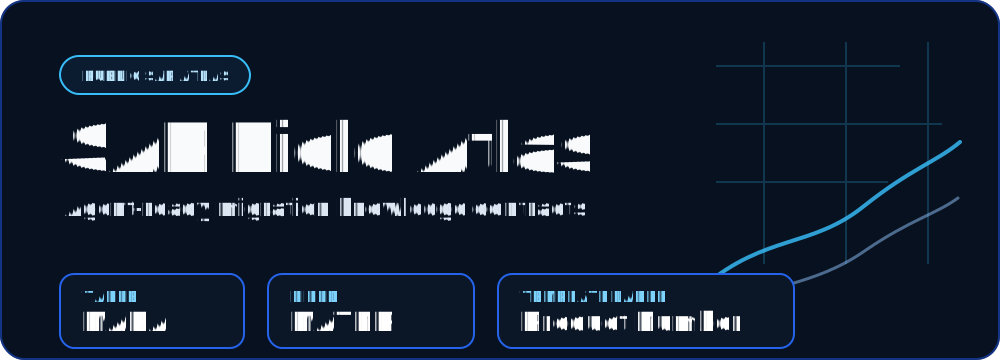

# SAP Field Atlas



**SAP Field Atlas is an agent-ready SAP data migration knowledge base.** It turns practical SAP consultant knowledge — transaction codes, tables, fields, labels, value sources, relationships, and Migration Cockpit mappings — into small, validated YAML contracts that humans and AI agents can inspect without needing a live SAP system.

[](LICENSE)
[](pyproject.toml)
[](https://github.com/viggomeesters/sap-field-atlas/releases/tag/v0.1.0)
[](SECURITY.md)
[](CHANGELOG.md)

## Why this exists

SAP data migration work constantly crosses ECC, S/4HANA, SAP GUI, Fiori, table exports, and SAP Migration Cockpit templates. The same concept can appear as:

- a technical table-field id such as `MARA-MATNR`;
- a business term such as **Material Number**;
- a template label such as **Product Number**;
- a context-specific export label or language-specific short/long label.

Consultants often keep this mapping knowledge in personal notes. Agents need it in structured, source-aware contracts. SAP Field Atlas is the public, generic version of that context pack.

## What is in the first release

The first release is intentionally small, but complete enough to clone, validate, and extend:

- YAML collections for transactions, Fiori apps, tables, fields, migration templates, domains/value sources, and relationships.
- Seed objects for `SE16N`, `SE11`, `MARA`, `MARA-MATNR`, and `T001-BUKRS`.
- A validation CLI that catches broken references, duplicate ids, invalid confidence labels, and unsafe verified facts without source refs.
- An agent answer contract in `skills/explain-sap-object.md`.
- Example explanations for `SE16N` and `MARA-MATNR`.
- Public-data guardrails for source confidence and customer-data safety.

## Quick start

```bash
git clone https://github.com/viggomeesters/sap-field-atlas.git
cd sap-field-atlas
uv run sap-field-atlas validate
uv run sap-field-atlas audit-completeness
uv run pytest -q
```

Or run the full local gate:

```bash
make check
```

## Use it as agent context

Give your agent this instruction after cloning or opening the repository:

```text
Use this repository as SAP Field Atlas context. For questions about transaction codes, tables, TABLE-FIELD ids, Fiori apps, Migration Cockpit labels, aliases, and SAP value sources, inspect data/*.yaml first. Use skills/explain-sap-object.md as the answer contract. Distinguish technical names from business/template labels and surface confidence/needs_verification instead of guessing.
```

Lookup pattern:

- transaction code → `data/transactions.yaml`
- `TABLE-FIELD` → `data/fields.yaml`
- table name → `data/tables.yaml`
- template label → `data/migration_templates.yaml` plus field labels
- value source/customizing → `data/domains.yaml`
- graph context → `data/relationships.yaml`

## Example questions

- Explain `SE16N`.
- Explain `MARA-MATNR`.
- Which labels can refer to Material Number / Product Number?
- Is Company Code free text or customizing-managed?
- Which table-field does a Migration Cockpit template field map to?

## Package and release

Release `v0.1.0` includes Python package artifacts attached to the GitHub release:

- wheel: `sap_field_atlas-0.1.0-py3-none-any.whl`
- source distribution: `sap_field_atlas-0.1.0.tar.gz`

Build locally with:

```bash
make package
```

Install directly from GitHub source with:

```bash
python -m pip install git+https://github.com/viggomeesters/sap-field-atlas.git@v0.1.0
```

## Repository layout

```text
data/           YAML knowledge contracts
schemas/        human-readable schema contracts
examples/       example agent answers
skills/         agent prompt/skill snippets
scripts/        repository guard and helper scripts
src/            Python validator/CLI
tests/          regression tests
docs/           architecture, roadmap, source policy, repo-complete notes
assets/         README/social hero assets
```

## Public safety

This is **not official SAP documentation** and does not mirror proprietary SAP content. Use source references and confidence labels. Do not add client names, customer exports, screenshots, internal URLs, project-specific mappings, or data copied from customer systems.

SAP Field Atlas is independent and not affiliated with SAP SE. See `NOTICE.md` for the trademark and affiliation notice.

See:

- `CONTRIBUTING.md`
- `SECURITY.md`
- `SUPPORT.md`
- `CODE_OF_CONDUCT.md`
- `NOTICE.md`
- `docs/source-confidence-policy.md`

## Project status

SAP Field Atlas is public and standalone:

- public repo: <https://github.com/viggomeesters/sap-field-atlas>
- package/module/CLI: `sap-field-atlas` / `sap_field_atlas` / `sap-field-atlas`
- current release: `v0.1.0`
- changelog: `CHANGELOG.md`
- maintainer checklist: `docs/MAINTAINER_CHECKLIST.md`

This repository is separate from any SAP FO Knowledge Base or customer-specific project knowledge base.

## Contributors

See `CONTRIBUTORS.md`.
